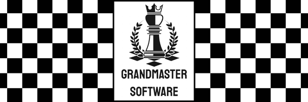

## Summary
***Grandmaster Software*** is a team of interns for the Murfreesboro Chess Club. 
Our client spent hours after each tournament entering results into the Chess Federation's website which is a bit dated. The website requires a lot of repeated and tedious data.
Once all data has been entered, it generates 3 DBF files that can be sent to the Federation to update ratings.
We developed this webapp as a solution to cut the time needed to enter in tournament results.
## Contributions
During this project, I contributed in several ways. I developed:

- A backend that takes the data entered and compiles it all into the necessary DBF files.
- Prefilled DBF data for the instances in which the Federation's generated DBF files request reentry of repeated data
